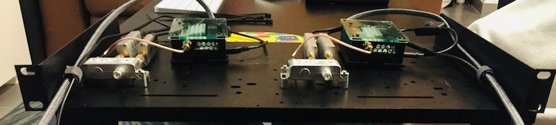
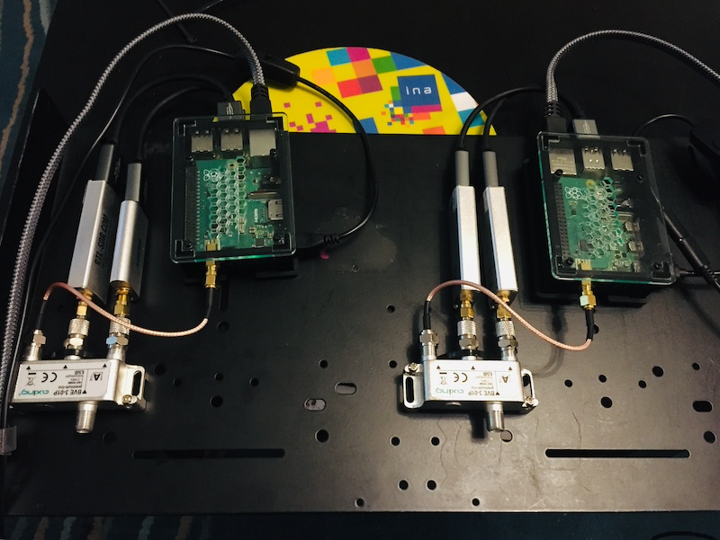

# dvbstream

Objectif: capter localement la télévision TNT avec une Raspberry Pi munie d'un [tuner DVB-T2 TV HAT](https://www.raspberrypi.com/products/raspberry-pi-tv-hat/) et/ou de [clés RTL-SDR](https://www.passion-radio.fr/cles-rtl-sdr/rtlsdr-tcxo-472.html).

Test avec 2 outils: `dvblast` et `mumudvb`.

## Multiplex

Dans les répertoires `conf/dvblast` et `conf/mumudvb` se trouvent les configurations des multiplex TNT disponibles sur Paris avec une adresse de diffusion multicast pour chaque chaîne.

## Configuration réseau

On va d'abord restreindre la plage d'ip multicast à la boucle locale pour ne pas innonder le réseau si les switchs ne sont pas optimisés pour le multicast (cf. [IGMP Snooping](https://fr.wikipedia.org/wiki/IGMP_snooping)).

```bash
ip route add 239.10.10.0/24 dev lo src 127.0.0.1
```

Puis pour vérifier les routes des cartes réseau :

```bash
$ route
Kernel IP routing table
Destination     Gateway         Genmask         Flags Metric Ref    Use Iface
default         lan.home        0.0.0.0         UG    202    0        0 eth0
192.168.1.0     0.0.0.0         255.255.255.0   U     202    0        0 eth0
239.10.10.0       0.0.0.0         255.255.255.0   U     0      0        0 lo
```

Note: la commande `route` fait parti du paquet `net-tools` sous `Debian`.

ou

```bash
$ ip route show
default via 192.168.1.1 dev eth0 src 192.168.1.74 metric 202
192.168.1.0/24 dev eth0 proto dhcp scope link src 192.168.1.74 metric 202
239.10.10.0/24 dev lo scope link src 127.0.0.1
```

Pour rendre cette règle persistante :

- sous `Debian` créer le fichier `/etc/network/if-up.d/local-multicast` (et le rendre exécutable) avec le contenu suivant :

```bash
#!/bin/sh

# à mettre dans /etc/network/if-up.d/local-multicast (rendre exécutable)
# le multicast ne sort pas de la boucle locale pour éviter de flooder le réseau

if [ "$IFACE" = "lo" ]; then
  ip route add 239.10.10.0/24 dev lo src 127.0.0.1
fi
```

- Sous `CentOS7` créer un fichier `/etc/sysconfig/network-scripts/route-lo` avec le contenu suivant :

```bash
239.10.10.0/24 via 127.0.0.1 dev lo
```

puis redémarrer le service réseau

```bash
systemctl restart network
```

## Applications

### dvblast

`dvblast` a pour rôle de demultiplexer le signal de la carte tuner, et diffuser un flux ip sur le réseau, en `rtp` par défaut.

Installation

```bash
apt install dvblast
```

Vérification

```bash
$ dvblast --version
DVBlast 3.4 (release)
```

### mumudvb

`mumudvb` est une évolution de `dvblast`

Installation

```bash
apt install mumudvb
```

Ajouter le nouvel utilisateur `_mumudvb` aux groupes `video` et `plugdev`

```bash
usermod -a -G video _mumudvb
usermod -a -G plugdev _mumudvb
```

`udp` par défaut. pour `rtp` utiliser `rtp_header` à `1` dans la [configuration](https://mumudvb.net/documentation/asciidoc/mumudvb-2.0.0/README_CONF.html).

### ffmpeg

`ffmpeg` est le couteau suisse de l'audiovisuel. Il permet transcodage, analyse, génération de fichiers media. On l'utilisera pour lire un flux rtp/udp et l'afficher directement sur la sortie standard. En mode passe plat.

Installation

```bash
apt install ffmpeg
```

Vérification

```bash
$ ffmpeg 2>&1 | head -1
ffmpeg version 4.3.4-0+deb11u1+rpt3 Copyright (c) 2000-2021 the FFmpeg developers
```

## Streamer un multiplex

Dans le répertoire `systemd` sont fournis 2 fichiers de services. Copions les au bon endroit :

```bash
cp systemd/dvblast@.service /etc/systemd/system
cp systemd/mumudvb@.service /etc/systemd/system
systemctl daemon-reload
```

Note: le chemin des apps et des logs peut être à adapter.

Pour commencer le stream d'un multiplex, utiliser l'une des commandes exemples suivantes :

```bash
systemctl start mumudvb@0_r1
systemctl enable --now dvblast@1_r15
```

le paramètre est de la forme `CARD_MUX` :

- `CARD` l'identifiant de la carte (0 ... 7)
- `MUX` l'identifiant du multiplex (r1 ... r15)

Lien: [Documentation sur Systemd](https://www.linuxtricks.fr/wiki/systemd-0-table-des-matieres-des-articles)

## Monitoring réseau

On peut contrôler qu'un multiplex est bien streamé sur la boucle locale avec `netstat` :

```bash
$ netstat -nu
Active Internet connections (w/o servers)
Proto Recv-Q Send-Q Local Address           Foreign Address         State
udp        0      0 127.0.0.1:41809         239.10.10.14:1234         ESTABLISHED
udp        0      0 127.0.0.1:52565         239.10.10.3:1234          ESTABLISHED
udp        0      0 127.0.0.1:39327         239.10.10.2:1234          ESTABLISHED
udp        0      0 127.0.0.1:45600         239.10.10.27:1234         ESTABLISHED
udp        0      0 127.0.0.1:37410         239.10.10.30:1234         ESTABLISHED
```

Note: avec `mumudvb` il n'y a pas le même résultat du netstat ...

D'autre part, l'outil `iptraf` permet d'avoir une vue d'ensemble du trafic réseau dans une interface texte.

```bash
apt install iptraf
```

## Enregistrer localement un flux

avec `ffmpeg`

```bash
ffmpeg -i rtp://239.10.10.2:1234 -c copy -map 0 rec.ts
```

ou encore mieux avec `multicat` (dépendance `bitstream`, se compile facilement)

- https://github.com/videolan/multicat
- https://github.com/videolan/bitstream

```bash
multicat -X @239.10.10.2:1234 /dev/null 2>/dev/null > rec.ts
```

Description des paramètres :

- `-X` : on demande à ce que le flux ts passe par la sortie standard
- `@239.10.10.2:1234` : on précise le groupe multicast auquel on veut s'abonner
- `/dev/null` : on ne veut pas d'écriture du flux sur disque
- `2>/dev/null` : on cache la sortie d'erreur
- `-u` à ajouter si le flux est `udp` "brut" et pas `rtp`
- `> rec.ts` : on redirige le flux vers un fichier

## Multicast vers Unicast

Dans le cas d'un réseau non compatible multicast et pour éviter le flood, il peut être intéressant de convertir le flux multicast en unicast.
Attention cependant à la volumétrie réseau si beaucoup de clients de connectent sur la source.

Installation de `udpxy`

```bash
git clone https://github.com/pcherenkov/udpxy
cd udpxy/chipmunk
make
sudo make install
```

Lancement manuel du service :

```bash
sudo udpxy -p 80 -c 8
```

Le service tournera sur le port 80 (`-p`) , avec un maximum de 8 clients (`-c`).

Lancement via `systemd` :

Voici également un [fichier de service systemd](conf/systemd/udpxy.service) pour udpxy.

```bash
cp conf/systemd/udpxy.service /etc/systemd/system
systemctl daemon-reload
sudo systemctl enable --now udpxy
```

Vérification que le service tourne :

```bash
$ netstat -an| grep ":80"
tcp        0      0 0.0.0.0:80            0.0.0.0:*               LISTEN
```

Maintenant, sur notre réseau local on va pouvoir demander, en unicast et en tcp, via le protocole http, une requête de ce genre :

```bash
vlc http://dvbstream/rtp/239.10.10.2:1234
```

- `dvbstream` étant l'ip/le host de la machine faisant tourner `udpxy`
- `/rtp/` ou `/udp/` suivant le procole de stream utilisé par la source
- `239.10.10.2:1234` l'ip et le port du groupe multicast source

Voici la [playlist.m3u](playlist.m3u) complète de toute les chaînes déclarées dans ce projet (ensemble des multiplex TNT parisiens).

## Bonus: générer une mosaïque de chaînes

Exemple de mosaïque muette avec positionnement des fenêtes en 2x2 sur un écran 1920x1080:

```bash
mpv http://dvbstream/rtp/239.10.10.2:1234  --mute=yes --no-border --geometry=960x540+0+0     --deinterlace=yes &
mpv http://dvbstream/rtp/239.10.10.27:1234 --mute=yes --no-border --geometry=960x540+960+0   --deinterlace=yes &
mpv http://dvbstream/rtp/239.10.10.10:1234 --mute=yes --no-border --geometry=960x540+0+540   --deinterlace=yes &
mpv http://dvbstream/rtp/239.10.10.11:1234 --mute=yes --no-border --geometry=960x540+960+540 --deinterlace=yes &
```

## Architecture globale

### Raspberry Pi n°1

- mux r1 (hat)
  - 24.8 Mb/s : https://www.digitalbitrate.com/dtv.php?mux=r1,idf&liste=1&live=1
  - `sudo systemctl enable --now dvblast@0_r1`
- mux r2 (sdr)
  - 24.8 Mb/s : https://www.digitalbitrate.com/dtv.php?mux=r2&liste=1&live=1
  - `sudo systemctl enable --now dvblast@1_r2`
- mux r3 (sdr)
  - 24.8 Mb/s : https://www.digitalbitrate.com/dtv.php?mux=r3&liste=1&live=1
  - `sudo systemctl enable --now dvblast@2_r3`

Total : 74.4 Mb/s

### Raspberry Pi n°2

- mux r4 (hat)
  - 24.8 Mb/s : https://www.digitalbitrate.com/dtv.php?mux=r4&liste=1&live=1
  - `sudo systemctl enable --now dvblast@0_r4`
- mux r6 (sdr)
  - 24.8 Mb/s : https://www.digitalbitrate.com/dtv.php?mux=r6&liste=1&live=1
  - `sudo systemctl enable --now dvblast@1_r6`
- mux r7 (sdr)
  - 24.8 Mb/s : https://www.digitalbitrate.com/dtv.php?mux=r7&liste=1&live=1
  - `sudo systemctl enable --now dvblast@2_r7`

Total : 74.4 Mb/s

### Raspberry Pi n°3

- mux r9 (hat)
  - 34 Mb/s : https://www.digitalbitrate.com/dtv.php?mux=r9&liste=1&live=1
  - `sudo systemctl enable --now dvblast@0_r9`
- mux r15  (sdr)
  - 16 Mb/s : https://www.digitalbitrate.com/dtv.php?mux=r15&liste=1&live=1
  - `sudo systemctl enable --now dvblast@0_r15`

Total : 50 Mb/s

### Photos





## Liste des tuners

Le répertoire `/dev/dvb` doit au moins contenir un `adapter` :

```bash
$ ll /dev/dvb/
total 0
drwxr-xr-x 2 root root 120 Mar  8 22:41 adapter0
drwxr-xr-x 2 root root 120 Mar  8 22:41 adapter1
drwxr-xr-x 2 root root 100 Mar  8 22:41 adapter2
```

Visualisation de 2 clés RTL-SDR branchées en USB :

```bash
$ lsusb | grep RTL
Bus 001 Device 004: ID 0bda:2838 Realtek Semiconductor Corp. RTL2838 DVB-T
Bus 001 Device 005: ID 0bda:2838 Realtek Semiconductor Corp. RTL2838 DVB-T
```

## Ressources

- https://aerogus.net/posts/diffuser-tele-radio-reseau-local/
- https://www.hospitableit.com/howto/streaming-dvb-t-over-an-ip-network-using-mumudvb-on-a-raspberry-pi-3/
- https://chiliproject.tetaneutral.net/projects/tetaneutral/wiki/Streaming_de_cha%C3%AEnes_TNT_sur_un_r%C3%A9seau_local
- [Tall Paul Tech](https://www.youtube.com/@TallPaulTech)
